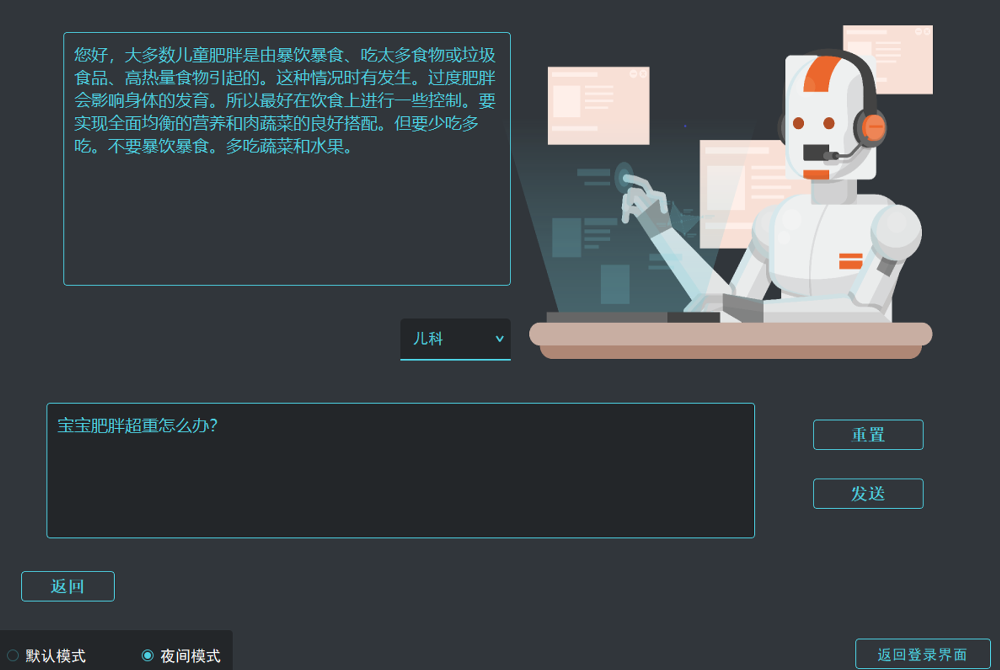

# 一个软件工程小作业
基于MySQL和Word2Vec模型实现一个简单的带机器人对话系统的医疗咨询平台



机器人对话的实现仅仅只是先由在语料上训练好的Word2Vec模型将语句转成词向量，并利用词向量实现语句相似性计算，利用已经准备好的问答数据集，返回相似性最高的问句对应的回答。

详细项目信息及设计思路说明可见设计文档: `智能医疗问答系统设计文档_Chanser.pdf`。

:wave: 本项目仅作参考交流，UI界面所用图片来源网络(由于时间过去太久我也忘了是从哪儿找到的)。感谢这些图片作者的贡献！如有侵权请联系我删除：shichen2001x@gmail.com 。

## :computer: 代码文件
`Client.py` 客户端程序

`Server.py` 服务器程序

`dbutil.py` 数据库工具类

`Robot.py` 机器人类

`erke.bin` Word2Vec模型文件(儿科问题相关)

## :partly_sunny: 环境
PyCharm Community Edition 2021.2.2

MySQL8.0/MySQL Workbench8.0 CE

PyQt5

Gensim(仅用于Word2Vec的训练，已提供训练结果文件)

## :clap: 语料
感谢Toyhom提供的中文医疗问答数据集: [Chinese medical dialogue data](https://github.com/Toyhom/Chinese-medical-dialogue-data)

## :dolphin: 运行
请先在`dbutil.py`配置您的数据库信息。
```
# 获取连接
def database_conn():
    try:
        conn = mysql_conn.connect(host = '*******',
                                  database = '*******',
                                  user = '*******',
                                  password = '*******'
                                  )
        return conn
    except mysql_conn.Error:
        print('数据库连接异常')
```

编译时，首先编译`Server.py`，待显示开始开放连接后编译`Client.py`客户端。


